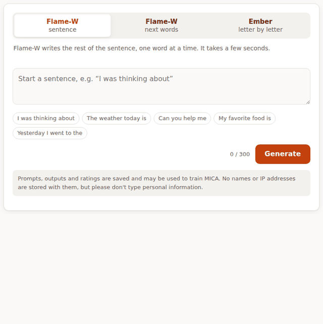

<p align="center"></p>

<h1 align="center">MICA AI</h1>

<p align="center"><b>An integer cellular automaton that writes language.</b><br>
No neural network and no floating point at inference: just learned integer rules on a ring of cells.</p>

<p align="center">
  <a href="https://mica-ai-ten.vercel.app"><b>Try it in your browser</b></a> ·
  <a href="RESEARCH.md">Research guide</a> ·
  <a href="CHANGELOG.md">Changelog</a> ·
  <a href="LICENSE">License (non-commercial)</a>
</p>

<p align="center"><br>
<sub>The live playground with Flame-W. The waiting time is sped up about 2×.</sub></p>

MICA is a learned integer-rule cellular automaton language model. Its reference
implementation follows the *MICA exact mechanism and learning specification*,
revision R1.

- **How it works:** each word (Flame-W) or byte (Ember) is written onto a ring of 768 cells ×
  112 integer channels. 16 phases of learned local rules run, and 240 probes read the result
  to score the next symbol. The same prompt always gives the same output, on any machine.
- **Where it stands:** Flame-W's rules see about the last 4 words.
  - Since v0.3, an integer **memory readout** lets it use the last 64.
  - It scores **30.95% on Tiny Theory-of-Mind**, above 6 of the 36 models on that leaderboard,
    and 5.27 bits per word on validation text.
  - These are research models, not assistants.

| Part | Where | Status |
|------|-------|--------|
| Engine and training code (R1) | [`r1/`](r1/) | added |
| MICA Flame-W (word model) | [`flame/`](flame/) | official B-740 + memory (v0.3, 2026-10-03), vocabulary and decoders |
| MICA Ember (byte/letter model) | [`ember/`](ember/) | official v0.2A checkpoint |

**Want to experiment or do research with MICA?** Start with [RESEARCH.md](RESEARCH.md): how it works, how to measure it, the open problems, and what has already been tried.

## Quick start

```bash
pip install -r requirements-dev.txt   # requirements.txt is numpy only, for the website
python -m pytest r1/tests -q          # 139 tests, including the §7 worked example
```

Generate text with Flame-W:

```bash
echo '{"id":"1","prompt":"I went to the"}' > prompts.jsonl
python r1/runs/claude_flame_word_20260928/word_decode.py sentence \
  --model mica:flame/runs/claude_flamew_b_20261001/train \
  --vocab r1/data/word/vocab.json --prompts prompts.jsonl --tag demo --out out.jsonl
```

The command above runs the automaton alone. With the v0.3 memory readout, as on the website:

```bash
python flame/runs/claude_flamew_memory_20261003/generate.py "I went to the"
python flame/runs/claude_flamew_memory_20261003/run_tom.py     # Tiny Theory-of-Mind, 30.95%
```

`sentence` writes a full sentence ("I went to the" → " movies with you.").
`suggest` gives a 2-3 word next-words suggestion ("Can you help me" → " find my").
Each output line in `out.jsonl` has the prompt and its `continuation`.

Generate text with Ember:

```bash
python r1/generate_bytes.py ember/runs/codex_ember_balanced_v02a_20260928/train "I don't know"
```

Both are research models. Neither produces reliably sensible sentences yet.

## Test website

`public/` and `api/` are a Vercel site where people try both models and rate the output:

| Path | What it does |
|------|--------------|
| `public/index.html` | The page: Flame-W sentence / next words, Ember letter by letter, 👍/👎 and "how should it continue?" |
| `api/flame.py`, `api/ember.py` | Run the official checkpoints with the exact integer engine (`webapp/`) and sign each output |
| `api/log.js` | Saves signed generations and feedback to a private Vercel Blob store |
| `api/export.js` | Owner download of all logs: `curl -H "Authorization: Bearer ADMIN_KEY" <site>/api/export -o logs.jsonl` (`?summary=1` for counts, `?check=1` for a storage check) |
| `r1/data/ingest_site_logs.py` | Turns that export into Ember byte records and Flame-W word records for training |

The site needs three environment variables: `LOG_SECRET`, `ADMIN_KEY` and `BLOB_READ_WRITE_TOKEN`.
The last one is set automatically when the Blob store is connected.

## What is where

| Path | Contents |
|------|----------|
| `r1/mica_r1/` | The engine: spec, exact integer engine, model file loader, decoders |
| `r1/data/` | Corpus builders; `r1/data/word/vocab.json` is the Flame-W vocabulary |
| `r1/runs/claude_flame_word_20260928/` | Flame-W word decoder (`word_decode.py`) and word metrics (`word_eval.py`) |
| `r1/run_train.py`, `r1/train_soft.py` | Training |
| `r1/checks/`, `r1/tests/` | Experiments, evaluations and tests |
| `docs/` | Findings, plans and experiment write-ups (`r1-findings.md`, `spec-gaps.md`, ...) |

`r1/mica_r1/score.dll` is a Windows build of `r1/mica_r1/score_kernel.c`.
See [`r1/README.md`](r1/README.md) for the engine layout and training commands.

## License

Free for **personal use** and **research use**.
**Commercial use is forbidden.** See [LICENSE](LICENSE) for the full terms.
For commercial licensing, contact the repository owner.
